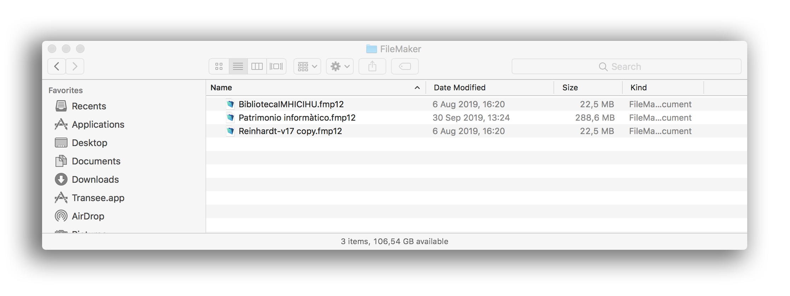

# Rationale #

* This repository shows an inner project, _in-house_ solution to track the bibliographical assets of the `Reinhardt collection`. 
* Just a Macbook Air (for testing and programming) and Ipad Air (to collect the data) on the hardware side. 
* The software that tied both hardware was FileMaker.
-
> Searching the condition `Reinhardt`

### What is this repository for? ###

* Quick summary
     - A solution-driven app to collect data (a basement where even a notebook can't operate successfully). 
     - We create this portable application to fix this bottleneck.    
     
* Version 1.7 
     - No further development is expected. 
     - All the data was collected properly and just in time.
     
### Issues ###

* Check them on [here](https://bitbucket.org/imhicihu/database-on-mobile-device/issues)

### How do I get set up? ###

* Summary of set up: 
     - Just install [FileMaker](http://www.filemaker.com/es/products/) in your computer (mac or pc)
     - Or install [FileMaker Go](https://itunes.apple.com/ar/developer/filemaker-inc/id314638464?mt=8) on your ipad & iphone device
     - Download our latest [database](/downloads)
     - Check [colophon.md](colophon.md)
* Configuration
     - Check the [issues](https://bitbucket.org/imhicihu/database-on-mobile-device/issues?status=new&status=open)
* Dependencies
     - Actually the latest [database](/downloads) can be read it on pc, mac & ipad with the latest Filemaker version. 
     
     - Verify system requirements in accordance to every operating system.
* Database configuration
     - FileMaker 13.0 and later (currently tested on v.12, v.13, v.14, v.15, v.16, v.17). 
     - Both PC, Mac, mobile and tablet fully comply with the latest version according every device
* How to run tests
     - Install the database on your selected medium. 
     - The database do **not** allow change any data. It just a browser with all the digital assets with a built-in searcher

### Related repositories ###

* Some repositories linked with this project:
     - [Bibliographical Searcher - Standalone app](https://bitbucket.org/imhicihu/bibliographical-searcher-stand-alone-app/)
     - [Terrae database](https://bitbucket.org/imhicihu/terrae-database/src/master/)
     - [Bibliographic data on iOS devices](https://bitbucket.org/imhicihu/bibliographic-data-on-ios-devices/)
     - [IMHICIHU Digital repository](https://bitbucket.org/digital_repository/imhicihu-digital-repository/)

### Contribution guidelines ###

* Writing tests
     - No allowed. Just queries.
* Code review
     - This project do not allow rewrite or modify the source-code. Copyright issues.
* Other guidelines
     - No. This is a companion, collateral project that fuel our internal bibliographical searcher of our website. There is _no_ plan to updates. The goal was reached.

### Who do I talk to? ###

* Repo owner or admin
     - Contact to `imhicihu` at `gmail` dot `com`

### Code of Conduct

* Please, check our [Code of Conduct](code_of_conduct.md)

### Legal ###

* All trademarks are the property of their respective owners.